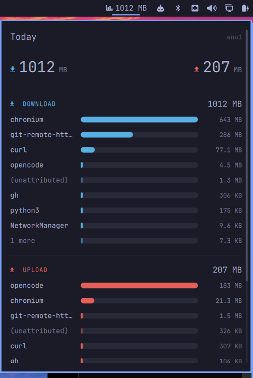

# Network Usage

Which apps used your bandwidth, one click from your Omarchy bar.



Two ranked bar charts — one for what came down, one for what went up — and a day of history
behind them. When a gigabyte went somewhere this afternoon, this is the thing that says where.

Measured at packet level rather than inferred from open sockets, so **UDP counts** — which today
means QUIC, which means most of what a browser does. Traffic from a **container** arrives under
the container's name instead of a hole in the numbers, which matters on the day a local build
pulled a few gigabytes and nothing on the machine will say what did.

An Omarchy **Quattro** shell plugin (`bar-widget` + `service`). Needs `omarchy-shell` and the
`nethogs` package from the standard repositories. No sudo or pkexec is required — nethogs grants
its own binary the capabilities it needs when it installs, and the plugin never asks for more.

---

## Install

**1. Install `nethogs`.** Nothing else on a stock Arch box attributes wire bytes to a process, so
the plugin has nothing to count without it — the kernel does not keep that score per app.

```bash
omarchy pkg add nethogs
```

No sudo or pkexec is needed afterwards: the package grants its own binary the capabilities it
needs at install time, and the plugin never asks for more.

**2. Add the plugin.**

```bash
omarchy plugin add https://github.com/oliwier-xiao/omarchy-network-usage.git --enable
```

If the bar does not pick it up:

```bash
omarchy restart shell
```

The panel will tell you if `nethogs` is not there yet. To ask directly:

```bash
~/.config/omarchy/plugins/oliwier.network-usage/bin/net-usage doctor
```

---

## What the numbers mean

**Wire bytes**, headers included, which run about 3% above the payload an app thinks it moved.
That is the honest figure — it is what your connection actually carried and what a data cap
counts.

Totals are counted continuously between samples, not sampled from them, so a shorter sample
interval does not make them more accurate. It only makes the panel newer.

## The unattributed row

Some bytes genuinely cannot be traced to an app from user space. A socket living in another
network namespace has no process on this side of it, and some overhead belongs to no app at all.
Rather than quietly dropping those bytes or spreading them over the apps that can be named, they
get their own row.

With **Name container traffic** on, most of what would land there is pulled back out and named,
so the row is usually small. If it is ever the largest bar, that is worth knowing rather than
worth hiding.

## Two charts, not one

Download and upload are different questions asked of the same list, and you almost always have
one of them in mind. Side by side in one chart, the answer to either is harder to find. Apart,
each chart ranks independently — the app that dominates your download often is not the one
dominating your upload, and two charts show that at a glance where one would bury it.

It also means colour is decoration here rather than the thing carrying the meaning, so nothing
is lost if the two hues read the same to you.

---

## Settings

| Setting | Default | What it does |
|---|---|---|
| Next to the bar icon | Download | `Download`, `Both directions`, or `Nothing`. Both roughly doubles the width. |
| Apps per chart | 8 | Bars drawn before the rest are summed into one row. Click that row, or press `e`, to list them all. |
| Name container traffic | on | Reads each container's own byte counters and puts a name on them. |
| Show what could not be attributed | on | Keeps the chart honest about the size of the gap. |
| Sample every | 2s | A battery setting, not an accuracy one. |
| Keep history for | 90 days | Older days are dropped when the file is next written. |
| Watch this interface | empty | Empty follows the default route. Name one when a tunnel is up. |

Set them from the bar's widget settings, or:

```bash
omarchy bar set oliwier.network-usage topApps 10
omarchy bar move oliwier.network-usage --section right
```

## Keys

| Key | Does |
|---|---|
| `↑`, `↓` | Scroll the panel |
| `e` | List every app, or fold the tail back up |
| `d` | Step through the last seven days |
| `t` | Back to today |
| `Tab` | Next panel |
| `Esc` | Close |

Clicking a day in the footer strip pins it; clicking today unpins.

The last row of each chart sums whatever did not fit — click it to list every app instead, and
**show fewer** to fold it back. Expanded charts are usually taller than the panel, which is what
the scrolling is for.

## From a terminal

The collector is a plain script and is useful on its own. This is the answer to "what is
using my connection right now":

```bash
~/.config/omarchy/plugins/oliwier.network-usage/bin/net-usage top
```

```
APP                              DOWN           UP  SOURCE
curl                           3.9 MB      76.4 KB  proc
webae-postgres                 2.9 MB      79.1 KB  container
(unattributed)                45.8 KB          0 B  unattributed
claude                         4.9 KB      65.9 KB  proc
```

`net-usage top [rows] [seconds]` watches for a few seconds and ranks what moved.
`net-usage doctor` reports what is missing. `net-usage probe` prints the interface, the date and
the container counters once.

## What it cannot tell you

- **A recycled process id** is attributed to whatever held that id before it, until the daily
  restart clears the slate. There is no way to see this from outside the tool.
- **A tunnel counts once.** With WireGuard or a VPN up, the same payload is visible as plaintext
  inside the tunnel and as encrypted UDP outside it. The plugin follows the default route and
  counts one of them; name the other under **Watch this interface** if it is the one you meant.
- **Traffic before the shell started** was not counted. This is a ledger kept from when it was
  opened, not a reconstruction.

---

## Removing it

```bash
omarchy plugin remove oliwier.network-usage
```

That leaves the history behind. To take that too:

```bash
rm -rf ~/.local/state/omarchy/network-usage
```

## Where things live

| Path | What |
|---|---|
| `~/.config/omarchy/plugins/oliwier.network-usage/` | The plugin |
| `~/.local/state/omarchy/network-usage/history.json` | Per-day, per-app totals |
| `~/.config/omarchy/shell.json` | Where the bar records your settings |

The history file is state, not config — numbers the machine produced rather than preferences you
set. If it is ever unreadable it is moved aside once as `history.json.broken` and counting starts
again, rather than the day being lost to a parse error.

## License

MIT — see [LICENSE](LICENSE).
